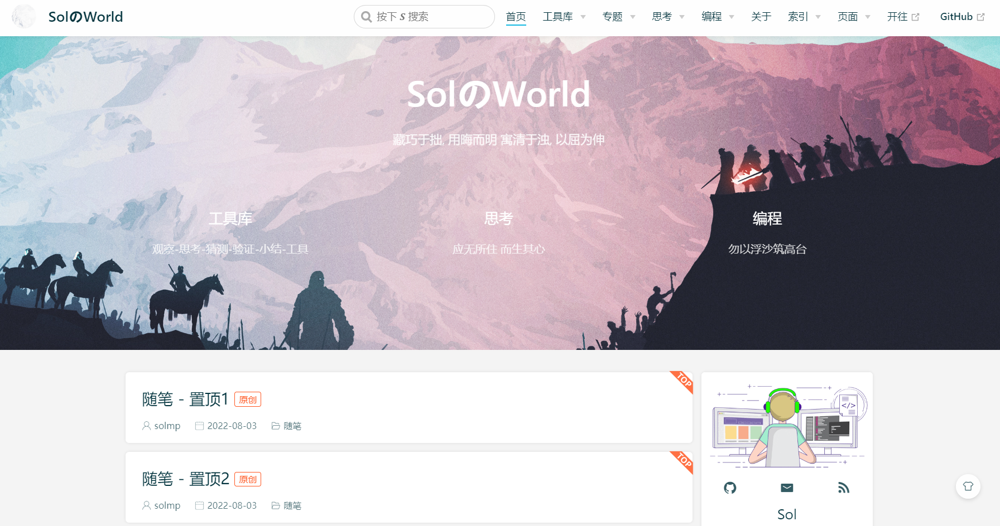
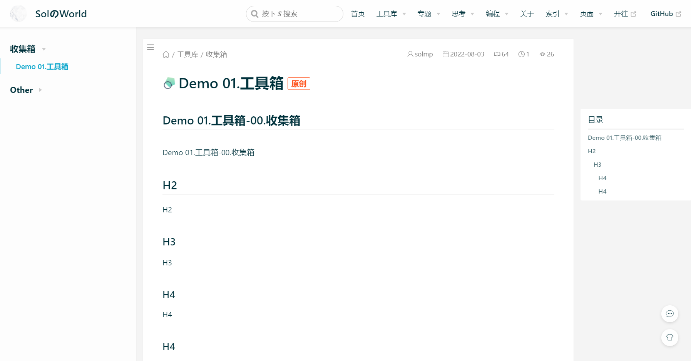

**Sol**

- 个人博客模板源代码仓库

**博客地址：** [https://solmp.vercel.app/](https://solmp.vercel.app/)

**博客模板预览：** [https://solmp-blog-template.vercel.app/](https://solmp-blog-template.vercel.app/)

**博客模板仓库：** [https://github.com/solmp/solmp-vdoing-blog-template](https://github.com/solmp/solmp-vdoing-blog-template)

# 页面展示

## 首页

## 文章页

# 博客模板 v1.1-template

## 版本信息

- 发布版本：v1.1
- 主题版本：[vdoing](https://github.com/xugaoyi/vuepress-theme-vdoing) - v1.12.7
- 发布时间：2022-08-06

### 变化内容

- 增加音乐插件 - meting
- 更新vuepress版本到1.9.7
- 通过editorconfig进行格式化
- 锁定版本
  - "vue": "2.6.14"
  - "vue-server-renderer": "2.6.14"
  - "vue-template-compiler": "2.6.14"

### 修复错误

- updateTheme配置
- 部分页面跳转错误

# 博客模板 v1.0-template pre

## 版本信息

- 发布版本：v1.0
- 主题版本：[vdoing](https://github.com/xugaoyi/vuepress-theme-vdoing) - v1.12.7
- 发布时间：2022-08-05

## 内容

- 博客页面：首页、索引页、文章页、分类、标签、归档、友链、收藏
- 自动化部署：服务器、仓库gh-pages分支、百度推送
- Waline、Gitalk评论系统
- 博客数据统计显示
- 文章数据统计显示
- rss、搜索插件、sitemap
- ...
